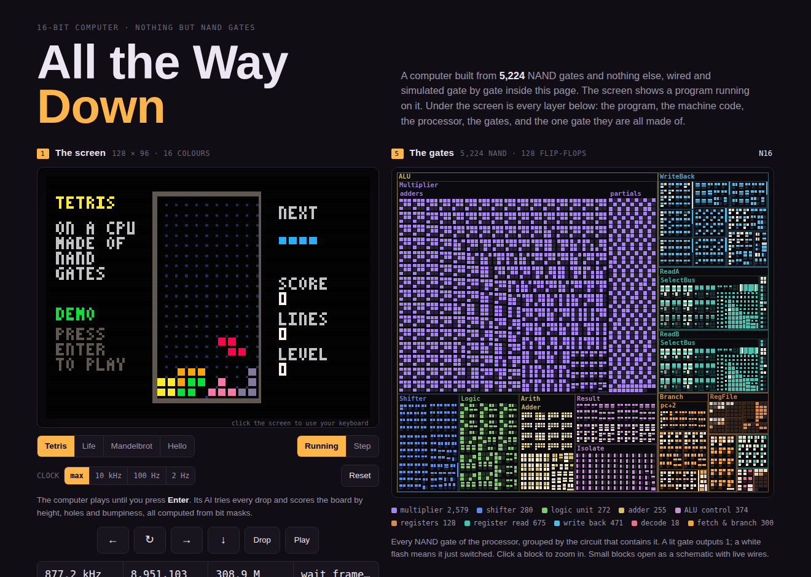
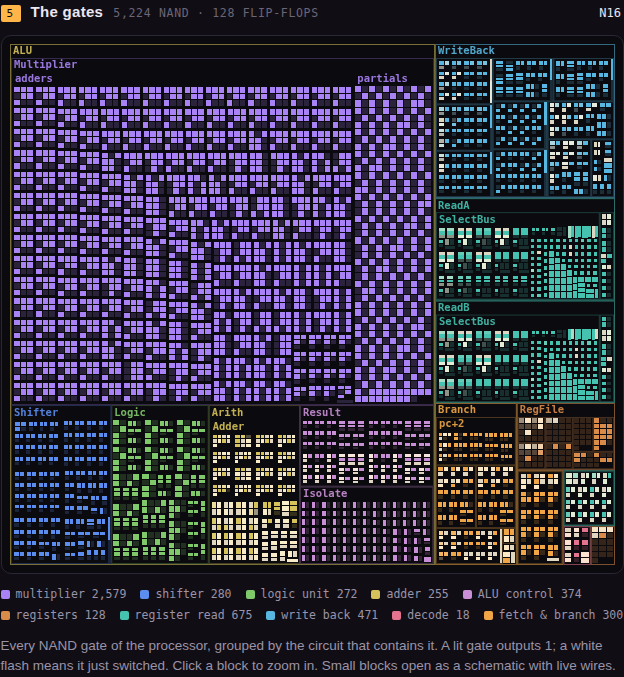
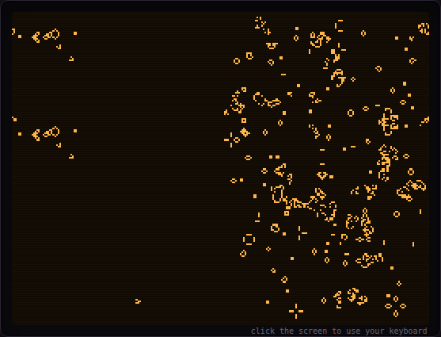

# All the Way Down

A computer built from nothing but NAND gates, and every layer above it, written from scratch.



Open **`dist/index.html`** in a browser. In a fraction of a second, the page:

1. wires **6,189 two-input NAND gates** and 128 flip-flops into a 16-bit processor,
2. optimises the netlist down to **5,224 gates** (still nothing but NANDs),
3. compiles that netlist into WebAssembly, where every gate is a handful of instructions,
4. compiles Tetris, Life and Mandelbrot from source with its own compiler,
5. and powers the machine on. It runs at **about 1.4 million clock cycles a second**, every cycle computed by
   the gates.

Then it shows you every layer at once. The screen, the program source with a live profiler, the machine code
following the program counter, the registers read from the flip-flops, and a die-shot map of every gate,
flashing as it switches. Click into the map and keep going: ALU → multiplier → one full adder, drawn as a
schematic of nine NAND gates with live signals on the wires.



## The layers

| # | Layer | What it is | Where |
|---|-------|------------|-------|
| 0 | NAND | The only logic primitive. `out = not (a and b)` | `src/hdl.js` |
| 1 | Gates | NOT, AND, OR, XOR, MUX, decoders, half and full adders (the 9-NAND one), ripple adders | `src/gates.js` |
| 2 | Processor | **N16**: 16-bit single-cycle RISC, 8 registers, barrel shifter, Baugh-Wooley signed array multiplier | `src/cpu.js` |
| 3 | Simulator | Pure-NAND logic optimisation, then a netlist → WebAssembly compiler | `src/netlist.js`, `src/wasm.js` |
| 4 | Assembler | Two passes, labels, expressions, pseudo-instructions, data section, source map | `src/asm.js` |
| 5 | Compiler | **Turtle**, a little C-like language, with a graph-colouring register allocator | `src/compiler.js`, `src/backend.js` |
| 6 | Library | Pixels, a 3×5 font, text and numbers, keyboard, timing, xorshift random numbers, in Turtle | `programs/lib.tt` |
| 7 | Programs | Tetris with an AI, bit-sliced Game of Life, fixed-point Mandelbrot | `programs/*.tt` |
| 8 | Page | Boots all of the above in the browser and lets you look inside | `web/`, `tools/build.js` |

### The processor

N16 executes one instruction per clock cycle. Instructions are 16 bits; an optional second word holds a
16-bit literal, fetched in the same cycle (the ROM has two read ports).

```
 15   14..13   12   11..9   8..6   5..3   2..0
  L    class    h     d      a      b      f
```

| class | instruction | meaning |
|-------|-------------|---------|
| 00 | ALU | `rd = ra OP B`, OP = `h:f`: add sub slt sltu and or xor andn shl shr sra mul mulh |
| 01 | load | `rd = RAM[ra + B]` |
| 10 | store | `RAM[ra + literal] = rb` |
| 11 | jump | if `cond(ra)` then `pc = B`; `rd = return address` (so `jal` is free). Conditions: z nz lt ge le gt, always |

`B` is register `rb`, or the literal when `L` is set. `r0` always reads zero. RAM and ROM are 64K words each.
The display reads video memory from RAM (256×192 mono or 128×96 in 16 colours), and the keyboard, a 60 Hz
frame counter and a random number appear at the top of RAM.

Where the gates go:

| Block | NAND gates | |
|-------|-----------:|---|
| Multiplier | 2,579 | 16×16 → 32 bit, signed, one cycle |
| Register read ports | 675 | two 7-way AND-OR selectors |
| Write back | 471 | the result multiplexers and write enables |
| ALU control | 374 | result selection and operand isolation |
| Fetch and branch | 300 | `pc+1`, `pc+2`, branch conditions |
| Shifter | 280 | 4-stage barrel shifter, both directions, arithmetic |
| Logic unit | 272 | AND, OR, XOR, AND-NOT |
| Adder | 255 | ripple-carry add/subtract and the comparisons |
| Decode | 18 | |

The logic unit, shifter and multiplier use **operand isolation**: when an instruction doesn't use them, their
inputs are held at zero and nothing inside them switches. Real chips do this to save power. Here it lets the
simulator skip those blocks exactly (a combinational block whose inputs did not change cannot change its
outputs), which roughly triples the simulation speed.

### Turtle

```c
const W = 16;
var board[21];
var shapes[] = { 0x00F0, 0x4444, 0x0F00, 0x2222 };

fn fits(p, r, x, y) {
  var m = shapes[p * 4 + r];
  for (var i = 0; i < 4; i++) {
    var bits = ((m >>> (i * 4)) & 15) << (x + 3);
    if (board[y + i] & bits) { return 0; }
  }
  return 1;
}
```

Every value is a 16-bit integer. There are functions and recursion, global arrays, strings, `mem[addr]` for raw
memory, C operators and precedence (with `>>>` for logical shift), short-circuit `&&` and `||`, and `mulh(a, b)`
for the high half of a signed product. Division compiles to a runtime routine, or to shifts for powers of two.

The back end generates code for unlimited virtual registers and then allocates the five real ones with a
Chaitin-Briggs graph-colouring allocator: liveness analysis, an interference graph, conservative coalescing,
biased colouring and cost-based spilling. On the Game of Life kernel it cut the cycles per generation from
538,000 to 214,000.

### The programs

- **Tetris** (`tetris.tt`): the board is twenty 16-bit masks with the walls in the spare bits, so a collision
  test is one AND per row. The AI places each piece by trying every rotation and column. It scores the result
  with aggregate height, holes, bumpiness and cleared lines, all from row masks and a popcount table.
- **Life** (`life.tt`): 256×192 on a torus, 16 cells per instruction. Two passes of bit-sliced adders compute
  the 3×3 population of every cell at once. Two Gosper glider guns fire into a random soup.
- **Mandelbrot** (`mandel.tt`): 4.12 fixed point. Pre-shifting both operands makes `mulh` a fixed-point multiply,
  one cycle per square. After drawing, it cycles the palette and zooms.

| Life | Mandelbrot |
|------|------------|
|  |  |

## How do we know it works?

```
npm test
```

- **Gates**: every basic gate against its truth table; adders on random inputs; the ALU against the ISA
  specification for all 16 functions on edge cases and random values.
- **Processor**: the gate-level CPU and the behavioural ISA emulator (`src/isa.js`) run random programs side by
  side and must agree on the program counter and every register after every burst of cycles, and on all of RAM.
  A directed test runs every jump condition on edge-case values. To check that these tests have teeth,
  `tools/mutate.js` injects a stuck-at fault into one random gate at a time: 100 out of 100 are caught (random
  programs alone catch 99; the directed branch test catches a fault deep in the zero detector).
- **Optimiser**: the unoptimised netlist is simulated separately and must agree too.
- **Flip-flops**: the simulator treats a D flip-flop as a primitive for speed. A test builds one from 11 NAND
  gates, settles its feedback loops gate by gate, and shows it behaves identically.
- **Compiler**: a fuzzer generates random programs full of deeply nested expressions and checks every result
  against a JavaScript reference (thousands of programs, some run on the gates).
- **Programs**: each demo runs on the emulator and on the gates for 300,000 cycles and must leave identical RAM.
  Life is checked generation by generation against a reference implementation.

## Running things

```
npm test                                   # the whole test suite
npm run build                              # bundle the page into dist/index.html
node tools/run.js programs/life.tt --frames 600 --png out.png          # headless run, screenshot
node tools/run.js programs/life.tt --frames 60 --png out.png --gates   # same, on the gates
```

No dependencies. Node 20+ for the tools, and any modern browser for the page. Where WebAssembly is not allowed,
the page falls back to a plain JavaScript gate evaluator (about ten times slower).

## Repository

```
src/hdl.js        circuit builder: NAND, flip-flops, memory ports, hierarchy
src/gates.js      the gate library
src/cpu.js        the N16 processor
src/netlist.js    pure-NAND logic optimisation
src/wasm.js       netlist -> WebAssembly, with exact skipping of idle blocks
src/sim.js        reference interpreter and the JavaScript fallback simulator
src/isa.js        the instruction set: behavioural emulator, disassembler, memory map
src/asm.js        assembler
src/compiler.js   Turtle: lexer, parser, constant folding, program layout
src/backend.js    Turtle code generation and register allocation
src/toolchain.js  source -> image, with a source map
src/display.js    the video device
programs/         lib.tt, tetris.tt, life.tt, mandel.tt, hello.tt
web/              the page and its script
tools/            bundler, headless runner, PNG encoder
test/             the test suite
```
